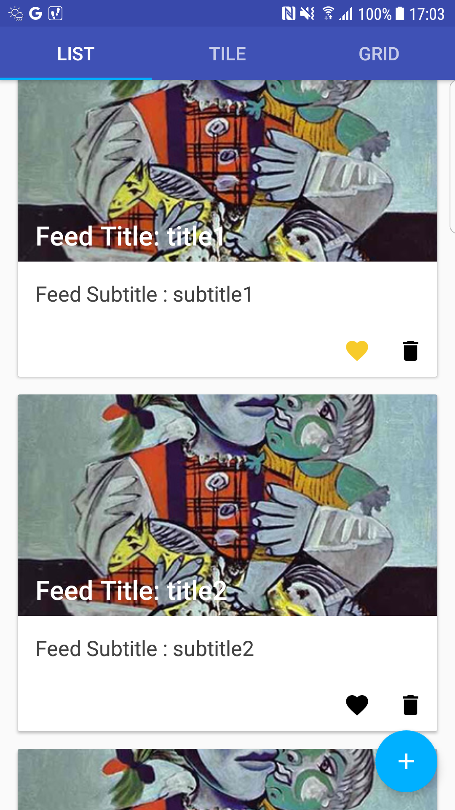
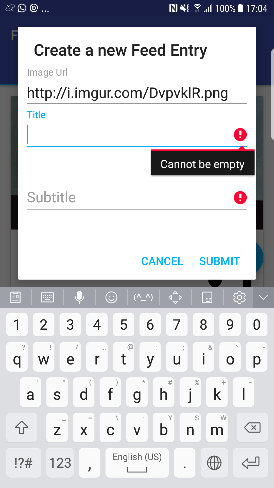
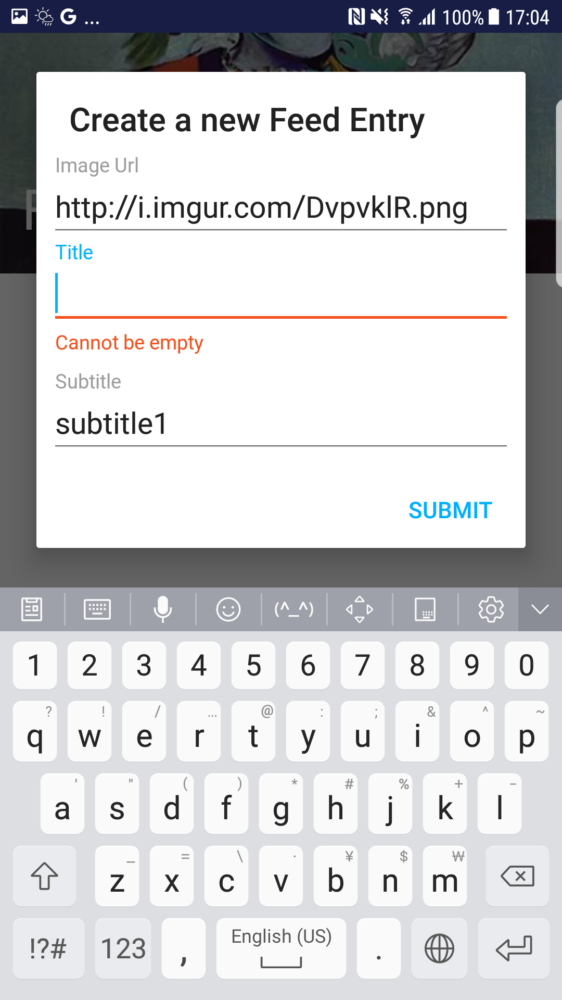
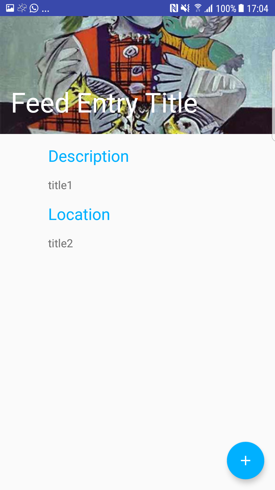

# FeedEntry

# Sample from Android Developer :
- Using the Feed Entry structure
- https://developer.android.com/training/basics/data-storage/databases.html

```java
@Entity(tableName = "feedEntrys")
public class FeedEntry {

  @PrimaryKey(autoGenerate = true)
  private int uid;

  @ColumnInfo(name = "title")
  private String title;
  @ColumnInfo(name = "subtitle")
  private String subTitle;

  @ColumnInfo(name = "imageUrl")
  private String imageUrl;


  @ColumnInfo(name = "favourite")
  private boolean isFavourite= false;

  //setter , getter, toString and constructors methods are skipped
}
```

# Implement the Room library Sample:
- Migration :
  - Add column "ImageUrl" for saving the image url (Migration1_2)
  - Add column "favourite" for saving the user favourite (Migration2_3)
- Insert , Update , Select , Delete

```java
@Dao
public interface FeedEntryDAO {

  @Query("SELECT * FROM feedEntrys")
  LiveData<List<FeedEntry>> getAll();

  @Query("SELECT * FROM feedEntrys WHERE uid = :uid LIMIT 1")
  LiveData<FeedEntry> findByUid(int uid);

  @Insert
  void insertAll(FeedEntry... feedEntries);

  @Delete
  void delete(FeedEntry feedEntry);

  @Update
  int update(FeedEntry feedEntry);

}
```

# Material Design
- From the sample in google Code lab : https://codelabs.developers.google.com/codelabs/material-design-style/#0
- Material Design and Piscasso Image load library

# Android Databinding
- Use the BindingAdapter in the TextInputLayout and try to separate the xml validation and activity validation independent
- https://stackoverflow.com/questions/37075871/can-i-bind-an-error-message-to-a-textinputlayout/46172133#46172133 


<p>
    
    
    
    
</p>
