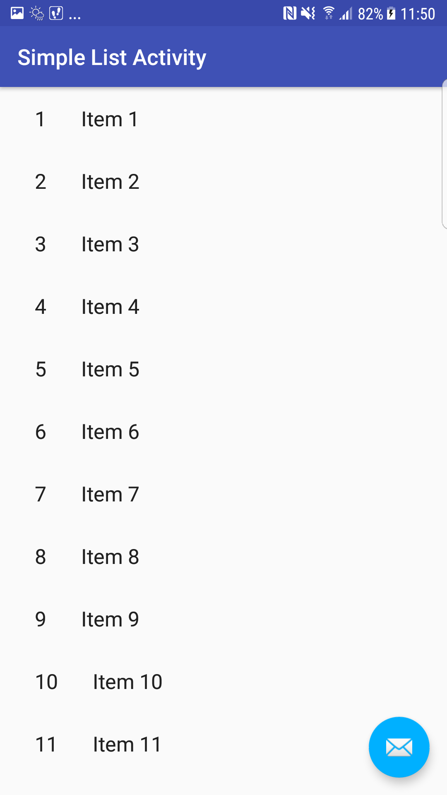

# Communication-Fragments

# Sample from Android Developer :
- Master Detail Template (From Android Studio Gallery)
- android.v4.ViewPager

  

# Master Detail Template
- Use the template import first and modified the template to fit Android App Architecture
- https://stackoverflow.com/questions/44272914/sharing-data-between-fragments-using-new-architecture-component-viewmodel/44655954#44655954
- Main Points :
 - Small Device (MasterFragment -> DetailFragment by ShareViewModel)
 - Large Device (ListActivity -> DetailActivity by putExtra method)
 - To keep it to the same codebase, we need to defined both ShareViewModel in ListActivity and DetailActivity. However, the value setting in DetailActivity will use putExtra method to transfer data

